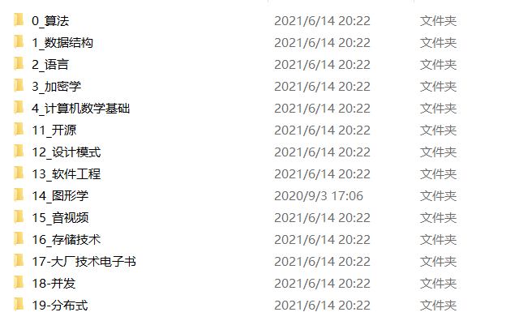

## [算法刷题安排，点击查看](https://docs.qq.com/sheet/DWUhxWHJ3QnpXbGxt)

### 1.怎么刷题？（刷题顺序）

- 快速刷完所有简单题，找到刷题感觉

- 一看二抄三改四写

- 总结 --> 输出 --> 回顾

- 对于简单题而言，每天尽量能刷至少一道

- 为了统一，编程语言推荐使用： **JAVA/C++**

  

### 2.讲题安排？

- 时间：每周组会结束后
- 随机抽人讲，现场手撕
- 对于简单题而言，时间有限制
- 每道题讲完，其他人有更优（时间 or 空间）解法，继续手撕
- 每周讲题的数量视具体情况而定

### 3.讲完题的总结

- 每次讲完题，有讲解该题的人写该题的题解（**markdown**格式），多种解法都要有
- 不仅要有输入，有效的输出也很重要

# 语言只是工具，算法才是灵魂！！！

大家不必纠结于语言，实践出真知，多动手才是王道！

[C++语法速查](https://en.cppreference.com/w/)

[JAVA语法速查](https://www.runoob.com/java/java-basic-syntax.html)  （也可以查jdk）

## 补充（计算机经典书籍-有需要的请自行下载）

[百度网盘](https://pan.baidu.com/s/1w9-kZYcSpu26Afy4RTfWCg)  提取码：7mve

